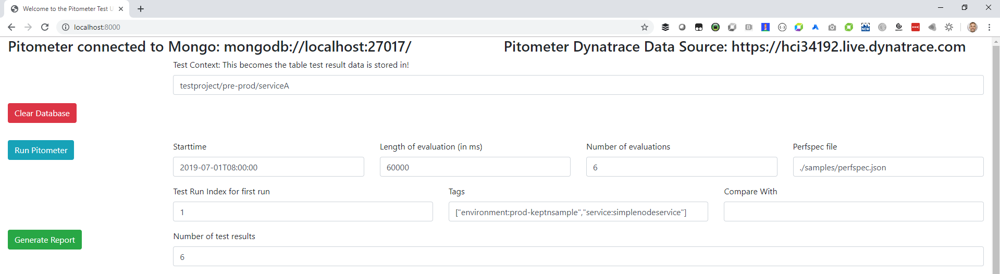
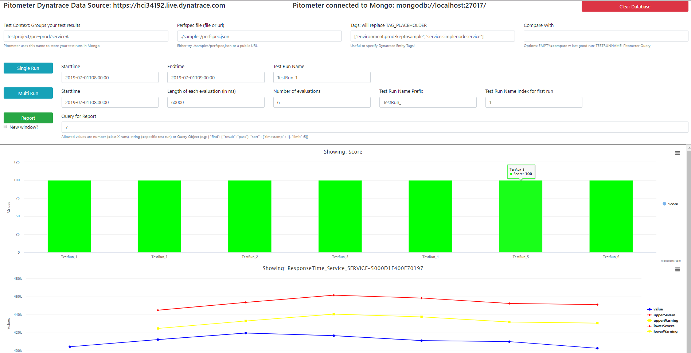

# pitometer-ui
This is a standalone version of Pitometer that hosts Pitometer as a service, stores its result in a mongodb and provides an API and a simple WebUI to trigger the following actions
* Clear the Test Results in the Database
* Run 1 or multiple Pitometer evaluations based on a spec file
* Display the results of 1 or more results in a chart

## How to run
1. Clone this repository
2. Create a secrets.json (for dynatrace url & token) & config.json (port and mongo reference) as shown below
3. Have a mongodb ready, e.g: using docker as described [here](https://www.thachmai.info/2015/04/30/running-mongodb-container/)
```
docker run -d -p 27017:27017 mongo
```
4. Then execute the following in your command shell
```
npm install
npm start
```
5. open your browers to http://localhost:YOURPORT



## Sample Use Case

### 1. Run Pitometer Evaluations
If you want to fill up your Pitometer database with a couple of results do this
1. In 'Startime" enter a timestamp  you know Dynatrace has collected data for at least one service. In the screenshot above this was July 1 2019 8AM
2. Enter the tags that uniquely identify your monitored service in Dynatrace. In the above screenshot I entered environment:prod-keptnsample & service:simplenodeservice. These tags will replace the placeholder TAG_PLACEHOLDER in the passed perfspec.json.
3. Click on 'Run Pitometer"! This will now execute 6 separate Pitometer runs with the first evaluating the timeframe from 8:00-8:01 then 8:01-8:02, ... - the results will be stored in the Mongo database in the collection with the name specified in the 'Test Context' input field on top. By default, Pitometer will compare every test with the last successful test run. The input field 'Comware With' allows you to specify other options!
4. Wait until the output says "Finished Runs!" or evaluate the error message in case something went wrong

Make sure you play around with the perfspec.json file. The one in samples/perfspec.json defines two metrics but you can extend this with any additional metric you like!

### 2. Generate a Report
If you want to see a report of the Pitometer data in your database simply click on 'Generate Report'. In my example I get a report across the last 6 test runs and it looks like this:



This report starts with the "Score" that pitometer calculated for each test run. The color indicates whether the score exceeded the pass (=green), warning (=orange) or failed (=red) objective! 
Following the score are the individual results for each Indicator that is specified in the perfspec.json file!

### 3. Clear Database
If you want to clear the database simply click on 'Clear Database'! This will remove the data stored for the 'Test context' specified in the top input field

## Calling the APIs directly
This standalone Pitometer UI not only provides the Web UI when browsing to /. It also provides individual API endpoints you can call directly if you wish. Here are the individual endpoints that the Web UI is calling when clicking on the 3 offered buttons:
```
Clearing the Database:
HTTP GET /api/cleardb?context=TESTCONTEXT

Running Pitometer Tests:
HTTP GET /api/run?context=TESTCONTEXT&perfspec=perfspecfile.json&start=STARTTIME&length=EVAL_TIMEFRAME&count=NUMBEROFRUNS&testRunIx=FIRSTTESTRUNIX&tags=TAGS_FOR_REPLACEMENT&comparecontext=COMPAREWITH

Getting Pitometer Report:
HTTP GET /api/report?context=TESTCONTEXT&count=NUMBEROFTESTRUNRESULTS
```


## Necessary Config files
You need to create the following config files
```javascript
secrects.json:
{
    "DynatraceToken" : "YOUR_TOKEN",
    "DynatraceUrl" : "https://XXXXX.live.dynatrace.com"
}

config.json:
{
    "port" : 8000,
    "mongodb" : "mongodb://MONGOSERVER:MONGOPORT/"    
}
```