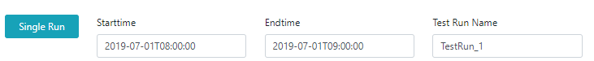
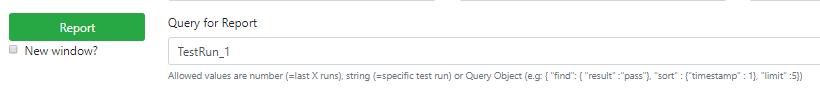

# Standalone Pitometer-UI
This is a standalone version of Pitometer that hosts Pitometer as a service, stores its result in a mongodb, provides an API and a simple WebUI to trigger the following actions
* Clear the Test Results in the Database
* Run a single Pitometer evaluation
* Run a set of Pitometer evaluations
* Display the results of 1 or more results

## How to run
1. Clone this repository
2. Create a secrets.json (for dynatrace url & token) & config.json (port and mongo reference) as shown below
3. Have a mongodb ready, e.g: using docker as described [here](https://www.thachmai.info/2015/04/30/running-mongodb-container/)
```
docker run -d -p 27017:27017 mongo
```
4. Then execute the following in your command shell
```
npm install
npm start
```
5. open your browers to http://localhost:YOURPORT


## Sample Use Case

When you run Pitometer evaluations you always need to specify the following input data:
* Test Context: this is a logical name for your results, e.g: project/environment/app. This value is used to organize your test results that belong to a test context
* Perfspec: this is your perfspec file that contains all the indicators & thresholds that should be evaluated. It can either be a file reference that the pitometer-ui service can access or an HTTPS public URL to a perfspec file. This project comes with a sample perfspec.json that you can use for testing!
* Tags: your perfspec file can have a TAG_PLACEHOLDER which will be replaced with the value of this field. A common use case is to pass in your Dynatrace Tags to identify the entities you want to query data for
* Compare With: if you run a Pitometer evaluation you can specify against which other test run result you want to compare to. If you leave it blank it will compare it with the last well test run result that has a "pass" score. You can also specify a specific testrun by its name or can use a Pitometer Query (is explained further below)

Now - lets go on with the use cases

### 1. Run a single Pitometer Test

If you want to run a single test you can specify "Starttime", "Endtime" and "Test Run Name" and click on "Single Run".
This will evaluate the perfspec file against the specified timeframe and will store the results in your test context with the name you specified as test run name, e.g: "TestRun_1"!



If everything goes according to plan you should see the output in the bottom half of the page saying: "Finished Run!". 

If you want to look at the result you can generate a report for just that test run:



### 2. Run Multiple Pitometer Evaluations

If you want to fill up your Pitometer database with a couple of results do this in the section for "Multi Run". Here are the fields you have to fill out and the meaning behind them

1. In 'Startime" enter a timestamp you know Dynatrace has performance data for at least one of your service. In the screenshot above this was July 1 2019 8AM
2. In 'Length of evaluation' you specify how long a single evaluation period should be, e.g: 60000ms equals to 1min. That would mean that Pitometer would do its first evaluation from 8:00AM to 8:01AM, the next from 8:01AM to 8:02AM ...
3. 'Number of evaluations' defines how many consecutive runs Pitometer does in a row. If you specify 6 I will have 6 results in total starting with the period 8:00AM-8:01AM and ends with 8:05AM-8:06AM.
4. Every result will be stored with a test run name. 'Test Run Name Prefix' allows you to specify your test run name. It will then be appended with the Test Run Index. By default Test Run Index starts with 1 but you can specify a different 'Test Run Index for First Run'. In my case I should get results stored with the names TestRun_1, TestRun_2, ...


After clicking on "Multi Run" Pitometer will start running all your evaluations sequentially. It will always re-evaluate with which test run it should compare the current evaluation with depending on what you have specified in 'Compare With'

If everything goes according to plan you should see the output in the bottom half of the page saying: "Finished Run!". 

If you want to see the results you can execute a report that shows you, e.g: the last 6 runs. More details on how to generate reports for several runs follow in the next section!

### 3. Generate a Report
If you want to see a report of the Pitometer data in your database simply click on 'Generate Report'. In my example I get a report across the last 7 test runs (one for my initial single run + 6 for my multi runs) and it looks like this. You have the following options for the 'Query for Report' field:
* NUMBER: specifies how many tests you want display starting with the most recent
* Test Run Name: If you just want to have a result of a single test run pass the name, e.g: TestRun_3
* Pitometer Query Language: see details below!


This report starts with the "Score" that pitometer calculated for each test run. The color indicates whether the score exceeded the pass (=green), warning (=orange) or failed (=red) objective! 
Following the score are the individual results for each Indicator that is specified in the perfspec.json file!

### 4. Clear Database
If you want to clear the database simply click on 'Clear Database'! This will remove the data stored for the 'Test context' specified in the top input field.

## Calling the APIs directly
This standalone Pitometer UI not only provides the Web UI when browsing to /. It also provides individual API endpoints you can call directly if you wish. Here are the individual endpoints that the Web UI is calling when clicking on the 3 offered buttons:
```
Clearing the Database:
HTTP GET /api/cleardb?context=mytestcontext

Running Single Pitometer Evaluation:
HTTP GET /api/singlerun?context=mytestcontext&perfspec=./samples/perfspecfile.json&start=2019-07-01T08:00:00&end=2019-07-01T08:01:00&testRunName=TestRun_1&tags=[%22environment:prod-keptnsample%22,%22service:simplenodeservice%22]&comparecontext=

Running Multiple Pitometer Evaluations:
HTTP GET /api/multirun?context=mytestcontext&perfspec=./samples/perfspecfile.json&start=2019-07-01T08:00:00&length=60000&count=6&testRunPrefix=TestRun_&testRunIx=1&tags=[%22environment:prod-keptnsample%22,%22service:simplenodeservice%22]&comparecontext=

Getting Pitometer Report:
HTTP GET /api/report?context=mytestcontext&count=7
```

## Necessary Config files
You need to create the following config files
```
secrects.json:
{
    "DynatraceToken" : "YOUR_TOKEN",
    "DynatraceUrl" : "https://XXXXX.live.dynatrace.com"
}

config.json:
{
    "port" : 8000,
    "mongodb" : "mongodb://MONGOSERVER:MONGOPORT/"    
}
```

## Compare With Option

When specifying the "Compare With" field you have the following options
* Empty: If you leave the field empty then Pitometer will automatically query the result of the last test that has the result pass.
* Test Run Name: To compare to a specific run just specify the Test Run Name, e.g: TestRun_2
* Pitometer Query Language: Specify a query as explained below

## Pitometer Query Language

This is a very simplified query language allowing you to specify a JSON object like the following example which returns 5 test results that have a result of 'pass' with a descending timestamp:
```
{
    "find": { "result" : "pass"},
    "sort": { "timestamp" : -1},
    "limit" : 5
}
```

As you have probably guessed. 'find' is like a WHERE clause, 'sort' is like an ORDER BY and 'limit' defines the number of results you want to have.
Here are the possible fields for both 'find' and 'sort': 
* result: can either be "pass", "warning" or "fail"
* totalScore: the actual achieve score
* testRunId: thats the name of your test run, e.g: TestRun_1
* timestamp: thats the timestamp when you ran the pitometer test. This IS NOT the start timestamp you passed into the test itself!


## Troubleshooting

In case you don't get a positive response when running a single or multiple tests then please validate the following
1. You properly configured the Dynatrace secrets, e.g: endpoint & API token
2. You deployed Dynatrace OneAgents in your environment and they are collecting data
3. You actually have performance data captured for the specified timeframe -> double check in Dynatrace
4. You have specified a perfspec file that references valid indicator data sources
5. If you are using the TAG_PLACEHOLDER feature - make sure that your entities in Dynatrace are actually containing these tags